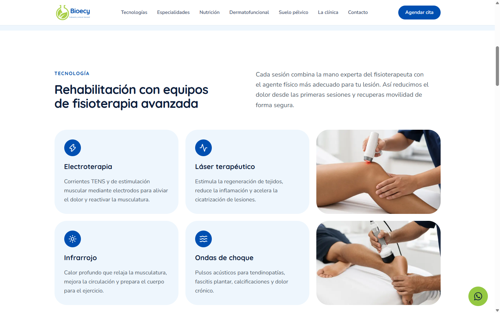
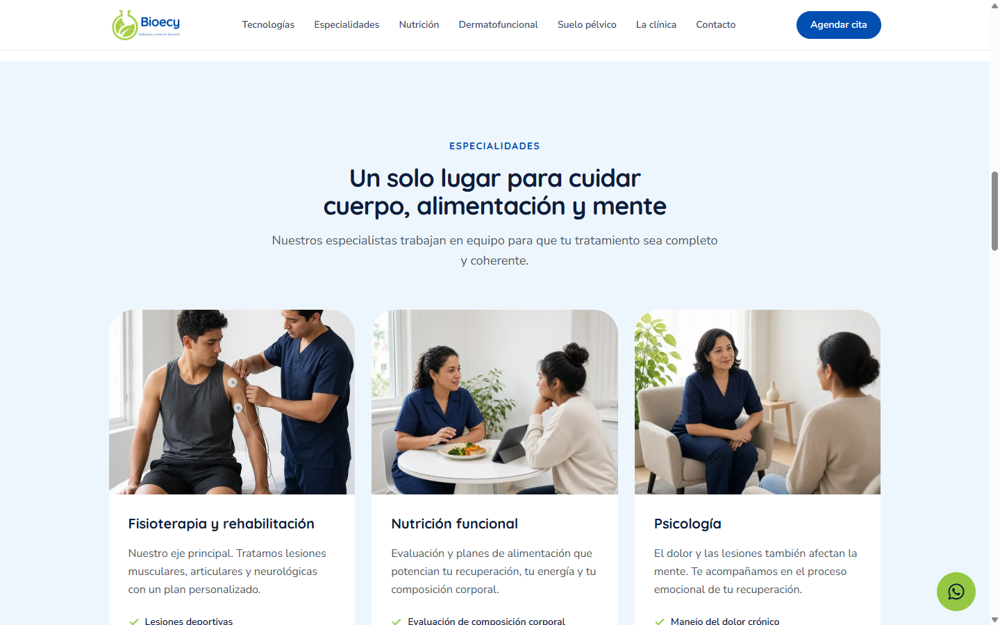
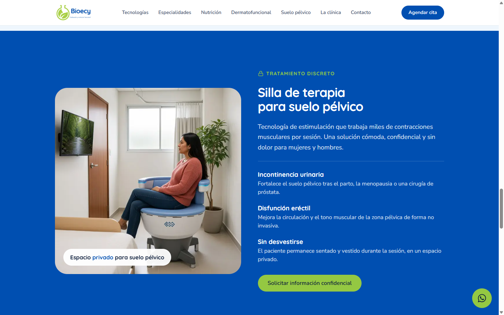
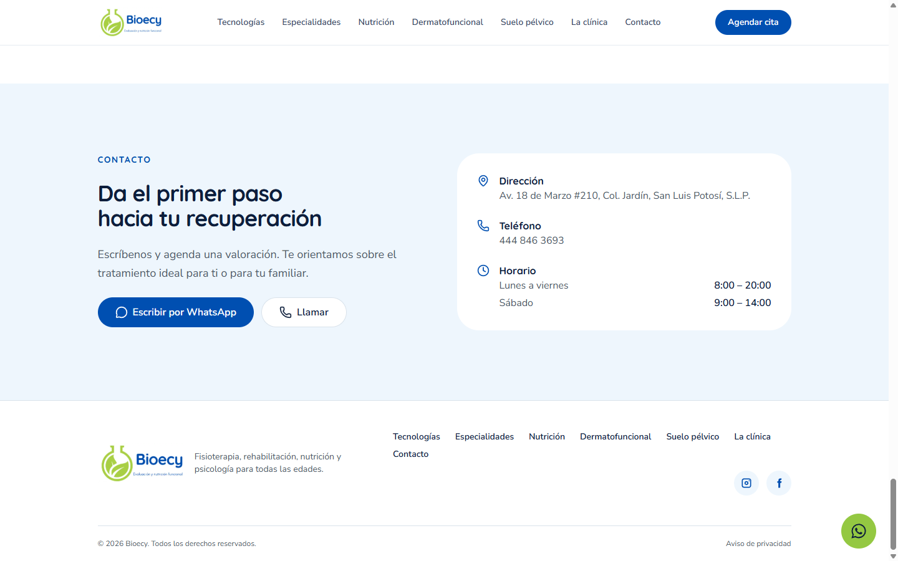

# Bioecy

Sitio de una página para **Clínica Bioecy** en San Luis Potosí: fisioterapia, rehabilitación, nutrición funcional, dermatofuncional, psicología y terapia de suelo pélvico. Agendar, Llamar y el botón flotante de WhatsApp usan el mismo número de entorno.

## Capturas

**Inicio (escritorio)**


**Inicio (móvil)**


**Tecnologías**



**Especialidades**



**Nutrición**


**Dermatofuncional**


**Suelo pélvico**



**La clínica**


**Contacto**



## Stack

- [Next.js](https://nextjs.org/) 16 (App Router) + React 19
- TypeScript
- Tailwind CSS v4 (`@theme` en `app/globals.css`)
- Botón shadcn / Radix (`components/ui/button.tsx`)
- Vercel Analytics (solo en producción)

## Estructura

```
app/                 # rutas: / y /aviso-de-privacidad
components/          # secciones de la landing + header/footer
lib/site.ts          # teléfono, WhatsApp, nav, dirección
public/images/       # logo y fotos
docs/screenshots/    # capturas de este README
```

## Requisitos

- Node.js LTS (20+)
- npm

## Desarrollo local

```powershell
npm install
copy .env.example .env.local
# edita .env.local y pon el número
npm run dev
```

Abre [http://localhost:3000](http://localhost:3000).

## Variables de entorno

Copiar `.env.example` a `.env.local` (local) o al dashboard de Vercel (Preview y Production).

| Variable | Requerida | Descripción |
|---|---|---|
| `NEXT_PUBLIC_WHATSAPP_PHONE` | sí, en producción | Dígitos con código de país, sin `+` ni espacios. Alimenta WhatsApp (`wa.me`), Agendar y Llamar (`tel:`). Ejemplo: `524448463693` |

Tras cambiar `NEXT_PUBLIC_*` en Vercel hace falta un **nuevo deploy** (Next inyecta en build).

## Deploy

Un proyecto Vercel con raíz en el repo (Next.js). Configurar `NEXT_PUBLIC_WHATSAPP_PHONE` en Preview y Production.

## Calidad

```powershell
npm run lint
npm run build
```
